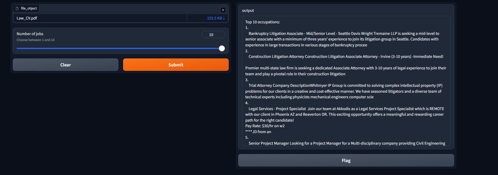
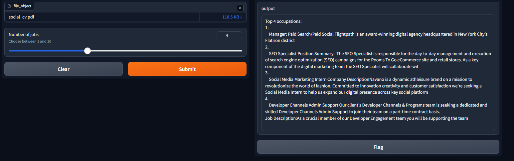

# CV-match-AI
Our project develops a resume match recommendation engine leveraging distilBERTg. This system will efficiently analyze a user's resume using distilBERT's pre-trained language understanding to determine the most relevant job matches for the candidate. 

Following dataset used to generate the processed job postings file: https://www.kaggle.com/datasets/arshkon/linkedin-job-postings

